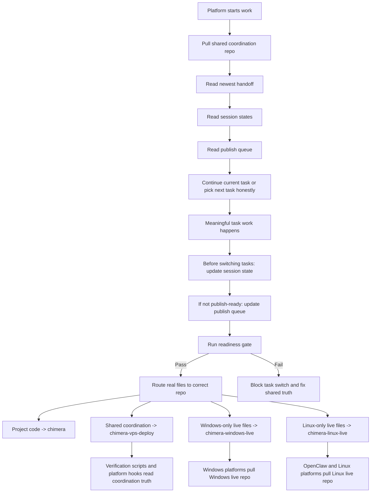

# GitHub Coordination Architecture

Updated: 2026-05-04

## Why This Exists

This architecture answers one simple problem:

an agent should not be able to leave one meaningful task and start another without leaving behind enough shared truth for the next platform to continue safely.

## The Four Repos

### `saloomad/chimera`

This is the main project repo.

Use it for:

- project code
- project research
- task and project tracking
- user-facing project workflows

### `saloomad/chimera-vps-deploy`

This is the shared coordination repo.

Use it for:

- handoffs
- shared skills
- platform startup instructions
- session state
- publish queue
- enforcement workflows
- verification scripts

### `saloomad/chimera-windows-live`

This is the Windows-only live repo.

Use it for:

- Windows-only scripts
- Windows-only local runtime helpers
- Windows-only startup or enforcement surfaces

### `saloomad/chimera-linux-live`

This is the Linux and OpenClaw-only live repo.

Use it for:

- Linux-only scripts
- OpenClaw runtime helpers
- cron, hook, and runtime-adjacent Linux surfaces

## How The System Works

## What Is Automatic

### Automatic at startup

- platforms are instructed to pull the shared coordination repo
- startup logic reads the newest handoff
- startup logic reads `session-states/`
- startup logic reads `publish-queue/`

### Automatic before a task switch

- task-change readiness checks the current platform state
- OpenClaw already has a live message-intake gate for this on the VPS
- shared validation scripts fail when state or queue truth is missing

### Automatic for new spawned OpenClaw workspaces

- the live OpenClaw bootstrap injects the GitHub coordination workflow and guide files

## What Is Not Automatic Yet

- Windows Codex does not have a native hard-stop hook inside the app
- Windows Claude does not have a real runtime task-switch denial proof from this pass
- those platforms are currently enforced by shared instructions, shared skills, and validation, not a native runtime blocker

## Why The Extra Files Are Not Supposed To Be Dead Ends

Every durable coordination file must have four things:

1. a purpose
2. a reader
3. a trigger
4. a proof command

That mapping lives in:

- `docs/GITHUB_COORDINATION_FILE_USAGE_REGISTRY_2026-05-04.md`

If a coordination file is not registered there, it should be treated as suspicious until fixed.

## The Core Workflow In Plain English

1. Start by reading the shared truth.
2. Do the current task.
3. Before switching to another meaningful task, tell GitHub what happened.
4. If the work is unfinished, say that honestly in the publish queue.
5. Run the gate.
6. Only move on if the next platform would understand what is going on.
