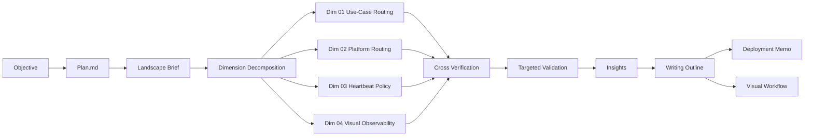

# Visual Workflow

## Control Room Checklist

- Objective
- Orchestration class
- Current phase
- Current gate
- Active workers
- Conflict status
- Rerun status
- Stop condition
- Final output path

## Mermaid Flow

## Human View Recommendation

### Top Summary

- show class, phase, freshness, and gate in one line

### Worker Matrix

| Dimension | Owner | Verdict | Confidence | Rerun Needed |
|---|---|---|---|---|
| use-case-routing | worker | aligned | high | no |
| platform-routing | worker | aligned with caveats | medium | no |
| heartbeat-policy | worker | aligned | high | no |
| visual-observability | worker | aligned | high | no |

### Conflict View

- no hard recommendation conflict
- medium-confidence gap around live platform proof expectations
- no targeted content rerun needed

## What To Avoid

- raw activity-only dashboards
- hiding unresolved issues in final conclusions
- treating heartbeat ticks as orchestration progress
